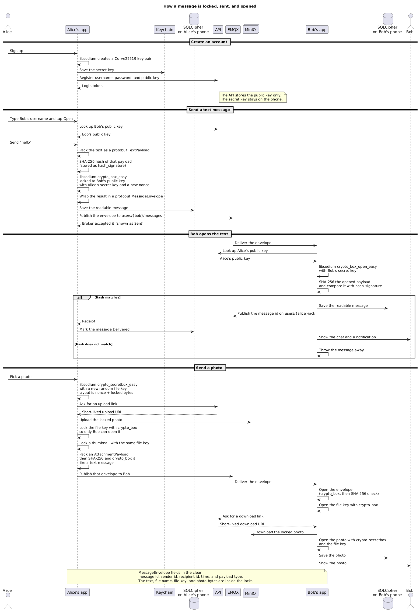

# Secure Messaging

A private chat app for iPhone. Messages and photos are locked on the phone before they are sent. The server keeps accounts and public keys. It cannot read the chats.

## What you need

| Tool | Why |
| --- | --- |
| Xcode 15 or newer | Builds and runs the iPhone app |
| XcodeGen | Creates the Xcode project. Install with `brew install xcodegen` |

Xcode includes Swift. The app downloads these libraries when you build:

- **libsodium** locks and unlocks messages and photos
- **SQLCipher** stores chat history in an encrypted database on the phone
- **CocoaMQTT** delivers messages between phones

The app is already pointed at the hosted services:

| Service | Address |
| --- | --- |
| API | https://api-production-1cfa4.up.railway.app |
| Message broker | `acela.proxy.rlwy.net` port `52882` |
| Photo storage | Private file bucket used by the API |

Accounts, public keys, and locked photos go through the API. Live messages go through the broker.

## Run the app

```bash
cd ios
xcodegen generate
open SecureMessaging.xcodeproj
```

In Xcode, pick an iPhone simulator and press Run. To chat between two people, run the app on a second simulator as well.

1. Create a different account on each simulator. Username at least 3 characters, password at least 8.
2. Allow notifications when the phone asks.
3. Type the other person’s username and tap **Open**.
4. Send a message. It shows up on the other simulator, with a notification.

Open Settings on both phones to compare the safety number, then mark the contact as verified.

Log out only ends the session. The key stays on that phone, so you can log back into the same account. If this phone no longer has a key, login creates a new one and saves the public key on the server. Tap **Open** while the other phone is signed in to copy messages that phone still has.

To run the tests:

```bash
swift test
cd backend && npm test
```

## How it is built

The phone locks and unlocks messages. The hosted services only help the phones find each other and pass locked data.

```text
iPhone                         Hosted services
┌─────────────────────┐        ┌─────────────────────────┐
│ Chat screen         │        │ API (accounts and keys) │
│ Lock and unlock     │─ REST ▶│ Database                │
│ Saved chats         │        │ Private photo bucket    │
│ Live messages       │─ MQTT ▶│ Message broker          │
└─────────────────────┘        └─────────────────────────┘
```



### iPhone app

The screens are SwiftUI. Each screen has a view model that holds the logic.

- Sign-up and login keep a key pair in the iPhone Keychain.
- The chat screen looks up the other person by username, locks the message for them, and sends it.
- Photos are shrunk on the phone, locked, then uploaded.
- Opened chats are saved in SQLCipher on the phone.
- When a new message arrives, the app unlocks it, shows the chat, and posts a notification.
- Tapping **Open** asks the other phone for messages it saved, then stores that copy here.

### Backend

A small Node.js API on Railway. It does not store message text.

| Address | What it does |
| --- | --- |
| `GET /health` | Says the API is up |
| `POST /v1/auth/register` | Creates an account and saves the public key |
| `POST /v1/auth/login` | Checks the password and returns a login token |
| `PUT /v1/users/me/public-key` | Saves a new public key for this account |
| `GET /v1/users/:id/public-key` | Finds someone by username or id |
| `POST /v1/media/upload-url` | Gives the phone a short-lived link to upload a locked photo |
| `POST /v1/media/download-url` | Gives the phone a short-lived link to download that photo |

Passwords are stored as a scrypt hash. The server only keeps the public key.

Live chat uses MQTT. Each person has `users/{their-id}/messages`. A receipt on `users/{their-id}/ack` lets the sender show **Delivered**. Saved chats are copied on `users/{their-id}/history`.

## How encryption works

Each account has a key pair from **libsodium**. The public key is shared. The secret key stays in the Keychain.

**Text.** The app locks the text with libsodium `crypto_box` and the other person’s public key. A new random nonce is used every time.

**Hash check.** Before locking, the app hashes the message with **SHA-256** (CryptoKit) and stores it in `hash_signature`. On open, libsodium checks the lock, then the phone hashes the text again and compares it. A mismatch is thrown away.

**Photos.** The picture is locked with libsodium `crypto_secretbox` and a one-time file key. The locked file goes to the private bucket. The file key is locked with `crypto_box` for the recipient and sent inside the chat message, with a small locked thumbnail.

**On the wire.** Messages use protobuf (`proto/messaging.proto`). The chat text is inside the locked bytes.

**On the phone.** Opened chats sit in SQLCipher. A 256-bit key in the Keychain opens that database.

## What the app can do

- Create an account and log in
- Send locked text and photos
- Show sent and delivered
- Keep chat history on the phone
- Copy missing messages from the other phone when you tap **Open**
- Open the right chat when a message arrives
- Show a notification with the sender’s name and a short preview
- Show a safety number so two people can confirm they have the right keys
- Switch between system, light, and dark appearance

## Limitations

When a conversation was not saved on this phone and is copied from the other phone, the text shows up. Photos in that copied history do not load as well as photos that were saved here when they were sent. New photos still send and open normally.

## Demo

[Watch the demo](docs/demo.mov)

## Where things live

| Part | Folder |
| --- | --- |
| Message format | `proto/messaging.proto` |
| Locking, database, and photos | `Sources/SecureMessagingKit` |
| iPhone screens | `ios/SecureMessaging` |
| API | `backend` |
| Local database, file storage, and broker | `docker-compose.yml` |
